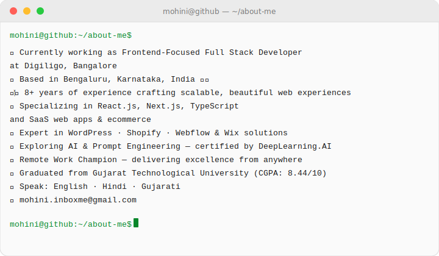
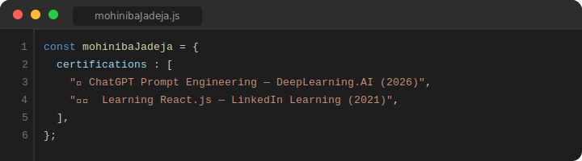

  

  
  &nbsp;
  
  &nbsp;
  

## 🛠️ Tech Stack

### 🌐 Frontend

  
  
  
  
  
  
  
  
  

### 🎨 UI & Design

  
  
  
  

### 🛒 CMS & Platforms

  
  
  
  
  

### ⚙️ Backend

  
  
  

### 🗄️ Database

  
  

### 🚀 Deployment

  
  
  
  
  
  
  
  

### 🤖 AI Integration

  
  
  

### ☁️ DevOps & Tools

  
  
  
  
  
  

## 🚀 Featured Projects

| # | Project | Description | Tech Stack | Links |
|:-:|---------|-------------|------------|:-----:|
| 1 | **💡 QuotePilotBase** | SaaS app |     |   |
| 2 | **📍 Map Pin Board** | Interactive location pin management app |    |   |
| 3 | **🛒 Direct Pallet** | Custom Shopify theme for modern e-commerce |   |  |
| 4 | **🔌 Custom Post Plugin** | WordPress plugin for custom post & user management |   |  |

## 📊 GitHub Stats

  
  &nbsp;
  

  

## 🎓 Certifications

## 🌐 Let's Connect!

  
  &nbsp;
  
  &nbsp;
  
  &nbsp;
  
  &nbsp;
  

  <i>✨ "Transforming ideas into stunning digital experiences, one line of code at a time." ✨</i>

